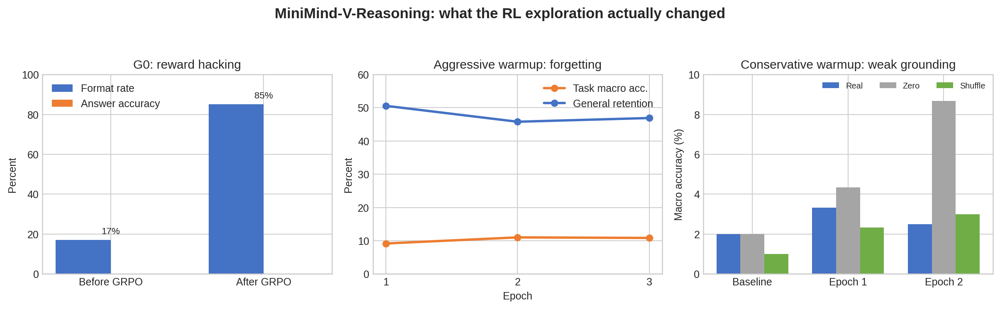

# MiniMind-V-Reasoning 实验报告

## 1. 研究问题与评测原则

本项目研究约 109M 参数语言主干在冻结视觉编码器条件下的多模态能力边界。实验只保留能支持结论的主线：视觉对齐、SFT 数据规模、CoT/Reasoning Dropout、规则 GRPO reward hacking，以及为判断是否应继续 RL 所做的两组短答案诊断。

评测遵循三条原则：

1. 同一消融使用相同初始化、固定验证集和生成设置；
2. 同时报告真实图、全零图和错配图，区分语言先验与视觉 grounding；
3. RL 不以平均奖励或格式率单独判定成功，必须同时改善 held-out 答案准确率并保留通用能力。

## 2. 模型与公共环境

| 项目 | 配置 |
|---|---|
| LLM | MiniMind Reasoning，108,946,176 参数 |
| 结构 | 16 layers，hidden 768，8 attention heads，2 KV heads，FFN 2048 |
| 视觉编码器 | SigLIP P32/256，冻结，64 visual tokens |
| Projector | 两层 MLP |
| 输出协议 | `<think>...</think><answer>...</answer>` |
| 硬件 | 4 × NVIDIA A10 24GB |
| 并行 | PyTorch DDP |

冻结的 SigLIP 约 93M 参数不计入“100M 小模型”的语言主干口径。

## 3. 视觉语言对齐是否成立

### 3.1 参数

| 参数 | 数值 |
|---|---|
| 初始化 | `reason_768.pth` |
| 数据 | 1,273,674 train / 1,024 fixed validation |
| 可训练模块 | Projector + LLM 第 0 层 |
| sequence length | 360 |
| batch size | 8/GPU，global batch 32 |
| epochs / steps | 1 / 39,803 |
| learning rate | 4e-4 |
| 训练耗时 | 1 h 53 min 25 s |

### 3.2 结果

| 条件 | Validation loss | 相对真实图 |
|---|---:|---:|
| Real image | 3.0470 | — |
| Zero image | 3.7419 | +22.81% |
| Shuffled image | 3.6754 | +20.62% |

训练 loss 最后 20 个日志点均值为 2.8587，峰值显存 2.44 GB/GPU，平均吞吐 189.45 samples/s。错配图仍来自真实图像分布，因此它比单独置零更能说明模型使用了与文本匹配的图像语义。结论是：**视觉语言对齐成立，但这是 teacher-forced token loss 证据，不等价于自由生成准确率。**

## 4. 通用 VLM-SFT 的数据规模收益

300K 与 600K 均从同一个 Pretrain checkpoint 初始化，配置和固定验证集一致；600K 集合包含 300K 集合。Full 是从 600K checkpoint 对剩余 2,303,511 条未见样本继续训练，因此只用于展示最终构建结果，不作为严格同初始化消融。

| 模型 | 训练数据 | 末 20 点训练 loss | 固定验证 loss | 256 样本 real-image loss |
|---|---:|---:|---:|---:|
| Pretrain | 1,273,674 | — | — | 4.9485 |
| SFT-300K | 300,000 | 3.2149 | 3.5408 | — |
| SFT-600K | 600,000 | 3.0104 | 3.3331 | 3.3800 |
| SFT-Full | +2,303,511 | 2.7593 | 3.0263 | 3.0692 |

600K 相对 300K 的固定验证 loss 降低 5.87%；Full 相对 600K 再降低 9.20%。Full 的 zero/shuffled loss 为 3.3161/3.3081，仍高于 real loss 3.0692。约 100M 模型在该范围内尚未出现明显数据规模饱和，但 token loss 的持续改善仍需生成准确率验证。

## 5. CoT-SFT 与 Reasoning Dropout

严格清洗后的 CoT 数据为 186,094 条；去重 71 条并留出固定验证集后，使用 185,023 条训练样本，加入 61,675 条 General replay（25%）。两组均从 SFT-Full 初始化。

| 参数 | 数值 |
|---|---|
| train rows | 246,698 |
| epochs | 2 |
| max length | 1024 |
| effective global batch | 64 |
| learning rate | 2e-6 |
| 唯一消融变量 | reasoning dropout = 0 / 0.2 |

| 模型 | 最优验证 loss | General token F1 | CoT off F1 | CoT on F1 | think 完整率 |
|---|---:|---:|---:|---:|---:|
| RD=0 | 2.5152 | 0.2420 | 0.2519 | 0.2280 | 76% |
| RD=0.2 | 2.5243 | 0.2274 | 0.2625 | 0.2316 | 83% |

RD=0 更好地保持通用生成，RD=0.2 则提高 reasoning-on 完整率和 reasoning-off CoT F1。两者没有单指标全面胜出。RD=0.2 被选作 GRPO 初始化，是因为它对有/无 think 两种模式更稳健，而不是因为其总体能力更强。

## 6. 规则 GRPO 与 reward hacking

### 6.1 G0 参数

| 参数 | 数值 |
|---|---|
| 初始化 | `cot_sft_rd02_768.pth` |
| train / validation | 1,000 / 200 |
| epochs | 1 |
| batch / accumulation | 1/GPU / 4 |
| prompt / generation length | 512 / 192 |
| generations per prompt | 4 |
| learning rate | 1e-6 |
| KL beta | 0.02 |
| sampling | temperature 0.8，top-p 0.9，top-k 50 |
| repetition penalty | 1.05 |
| reward weights | format 0.3，tag 0.1，answer 0.6 |

### 6.2 审计结果

在固定 100 条样本上比较 GRPO 前后：

| 模型 | 格式率 | tag score | 答案准确率 | 平均奖励 |
|---|---:|---:|---:|---:|
| CoT-SFT RD=0.2 | 17% | 0.6375 | 0% | 0.1148 |
| GRPO G0 | 85% | 0.9175 | 0% | 0.3467 |

奖励提高 202%，但完全来自格式与标签；答案能力没有任何提升。这是明确的 reward hacking，而非“效果较弱”。根因包括：格式分可在答案错误时独立获得、选择题/数字/OCR 的答案解析不够稳健，以及 base policy 正确样本过少导致组内优势缺乏真实能力信号。

保留的修复包括：

- 选择题、千分位数字、Unicode OCR 的类型化解析和回归测试；
- bbox 等不可靠规则默认不给答案分；
- `correct_only_format_bonus`：只有答案正确时才附加格式奖励；
- 多 token `</answer>` 停止序列，避免闭合后继续生成；
- 变长 rollout padding 修复和按任务评测。

修复奖励只能堵住漏洞，不能凭空制造正确 rollout，因此下一步先测试 SFT 能否把策略带到可学习区间。

## 7. RL 准入诊断

### 7.1 高权重短答案 warmup：能力提升伴随遗忘

训练集为 5,000 条（2,000 multiple-choice、1,500 counting、1,500 OCR），从 RD=0.2 初始化。参数为 3 epochs、batch 5/GPU、gradient accumulation 3、max length 768、learning rate 3e-6、answer/XML/EOS token loss weight 4，全部 LLM 与 Projector 可训练。

| Epoch | MC accuracy | Counting | OCR | Macro | pass@4 | General F1 retention |
|---:|---:|---:|---:|---:|---:|---:|
| 1 | 27% | 0% | 0.5% | 9.17% | 23.33% | 50.57% |
| 2 | 29% | 4% | 0% | 11.00% | 29.33% | 45.79% |
| 3 | 29% | 3.5% | 0% | 10.83% | 27.67% | 46.91% |

模型学会了部分选择题格式与决策，但计数/OCR 几乎没有形成能力，并发生严重灾难性遗忘。此 checkpoint 未获 GRPO 准入。

### 7.2 保守 warmup：保住通用能力但视觉成功率仍不足

为减少遗忘，使用 23,334 条 materialized short-answer + 10,000 条 General replay（70/30），只训练顶部 4 层与 Projector；2 epochs，batch 5/GPU，accumulation 3，max length 768，learning rate 1e-6，answer loss weight 2，Reasoning Dropout 0.2。诊断集包含 200 条 MC、200 条 counting、200 条 OCR，且与训练 ID 不重叠。

| 模型 | Normal macro | Zero macro | Shuffle macro | General F1 | General retention |
|---|---:|---:|---:|---:|---:|
| RD=0.2 baseline | 2.00% | 2.00% | 1.00% | 0.2274 | 100% |
| Epoch 1 | 3.33% | 4.33% | 2.33% | 0.2185 | 96.10% |
| Epoch 2 | 2.50% | 8.67% | 3.00% | 0.2192 | 96.42% |

通用能力得以保留，但正常图像并未稳定优于 zero/shuffle；Epoch 2 甚至在 zero 条件下更高。这说明模型主要在利用答案先验和格式，而不是可靠读取图像。两轮均未通过 RFT/GRPO 准入门槛。

## 8. 面向 100M 小模型的结论

1. 约 109M 模型可以通过冻结视觉塔 + 小型 Projector 建立可测的视觉语言对齐，且扩大 SFT 数据仍能降低验证 loss。
2. 从“token 级利用图像”到“生成时基于图像做出正确短答案”存在明显鸿沟；模型容量、视觉 token 压缩和训练目标都可能成为瓶颈。
3. 结构化 CoT 对输出行为的影响大于对答案正确率的影响。对小模型而言，长推理还会消耗有限生成预算，并放大模板依赖。
4. 规则 GRPO 的前提不是奖励函数能运行，而是 base policy 已经产生足够多、可由规则可靠识别的正确样本。当前模型未满足这一条件。
5. 最合理的停止点是保留 GRPO 实现和失败分析，不继续扩大 RL。后续若重启，应优先提高视觉短答案 SFT 的真实/错配图差距，再设置“正确率、视觉增益、通用保持率”三重准入门槛。

## 9. 结果图

下图把 RL 探索中最关键的三件事放在一起：G0 只提升格式；激进 warmup 以通用能力遗忘换取有限短答案准确率；保守 warmup 保住通用能力，却没有建立稳定视觉增益。

因此，本项目的负结果是可解释且可复现的：**100M 级策略尚未跨过视觉决策的 RL 准入门槛，继续优化格式奖励没有意义。**
