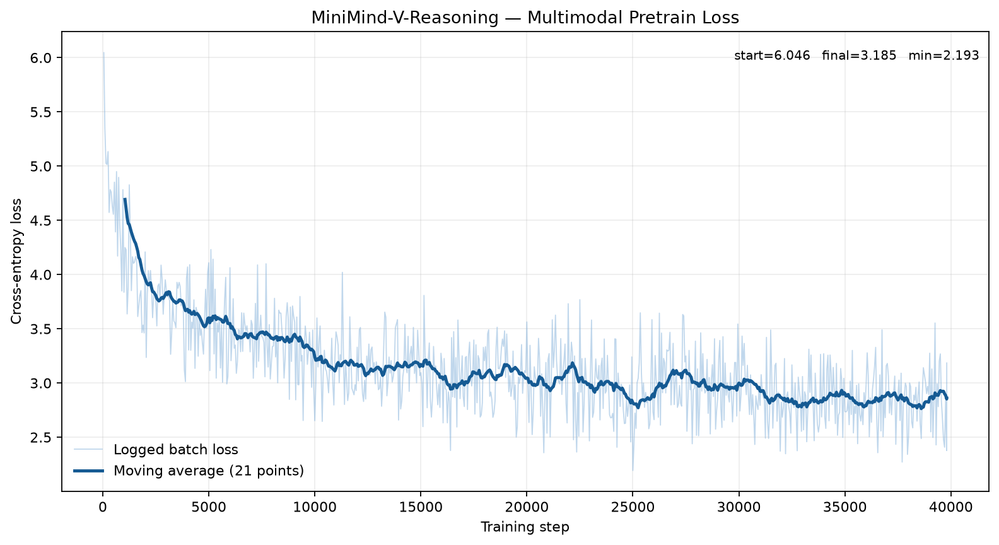
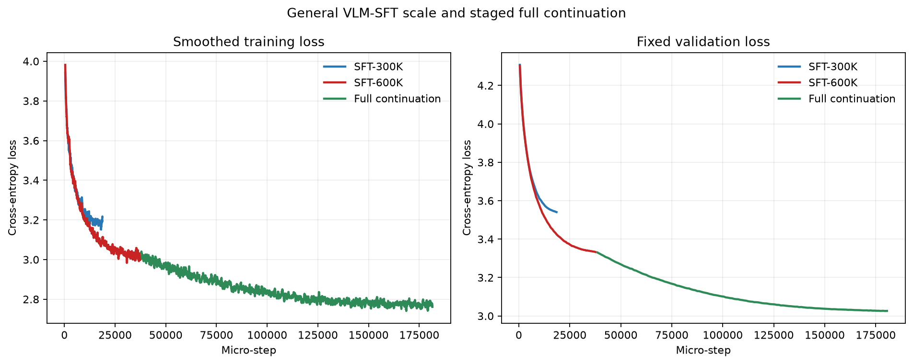

# MiniMind-V-Reasoning Experiment Report

本文详细记录影响模型能力结论的主要实验与消融结果。

## 1. 实验总览

| 编号 | 实验 | 核心变量 | 状态 |
|---|---|---|---|
| E1 | CoT数据蒸馏 | 四卡异步教师生成 | 已完成 |
| E2 | CoT质量清洗 | 是否过滤模板化元推理 | 已完成 |
| E3 | Multimodal Pretrain | 真实图像 vs 全零图像 vs 错配图像 | 已完成 |
| E4 | General VLM-SFT | 30–60万分层数据 vs 分阶段全量数据 | 已完成 |
| E5 | CoT-SFT | 无CoT vs CoT；Dropout 0 vs 0.2 | 已完成 |
| E6 | Rule-based GRPO | SFT策略 vs GRPO策略 | 待实验 |

## 2. E1：CoT数据蒸馏

### 目的

从大规模图文SFT数据构造一句式结构化CoT，并将蒸馏控制在单机4卡约10小时内。

### 方法

- 教师：Qwen2.5-VL-7B-Instruct
- 部署：4张A10各运行一个vLLM实例
- 数据：确定性哈希抽样
- 输出：教师生成`<think>`，`<answer>`沿用原始答案
- 容错：每500条写Parquet分片和checkpoint
- 约束：推理语言与原始问答语言一致

### 结果

| 指标 | 数值 |
|---|---:|
| 原始行数 | 2,904,511 |
| 有效候选 | 2,202,245 |
| 候选池 | 360,000 |
| 请求尝试 | 301,551 |
| 成功样本 | 300,023 |
| Parse fail | 1,192 |
| Language fail | 336 |
| 成功率 | 99.49% |
| 最终吞吐 | 10.15 samples/s |
| 总耗时 | 8小时13分钟 |

### 结论

短输出、异步请求和四个独立vLLM实例适合单机多卡数据蒸馏；30万级样本可在一个工作日内完成。

## 3. E2：CoT质量清洗消融

### 目的

比较“仅保证XML格式”和“进一步过滤模板化元推理”的数据质量差异。

### 方法

只检查`<think>`内容，过滤“the answer follows”“reference answer”“该答案”等不分析问题本身的元叙述，不修改答案与图片。

### 结果

| 数据版本 | 样本数 | 元推理残留 | 格式/空答案/损坏图片 |
|---|---:|---:|---:|
| 格式清洗后 | 300,023 | 113,929 | 0 |
| 严格语义清洗后 | 186,094 | 0 | 0 |

严格清洗保留率为62.03%，另有71条重复conversation待训练采样时去重。

### 结论

格式正确不代表推理有效。后续CoT-SFT使用186,094条严格清洗数据，并将未严格清洗版本仅作为数据质量消融对照。

## 4. E3：Multimodal Pretrain

### 目的

在Reasoning LLM上建立视觉语言对齐，并通过图像置空消融验证模型确实使用视觉信息。

### 设置

| 项目 | 配置 |
|---|---|
| 初始化 | `reason_768.pth` |
| 数据 | 1,273,674训练 / 1,024固定验证 |
| 视觉编码器 | SigLIP P32/256，冻结 |
| 可训练模块 | Vision Projector + LLM第0层 |
| GPU | 4×A10 |
| Batch | 8/卡，global batch 32 |
| Sequence length | 360 |
| Epoch | 1 |
| Learning rate | 4e-4 |

### 训练结果

| 指标 | 结果 |
|---|---:|
| Steps | 39,803 / 39,803 |
| Wall time | 1小时53分25秒 |
| 日志点 | 797 |
| 首个记录loss | 6.0462 |
| 最后记录loss | 3.1847 |
| 最后20点平均loss | 2.8587 |
| 最低记录loss | 2.1931 |
| 平均吞吐 | 189.45 samples/s |
| 峰值显存 | 2.44 GB/卡 |

曲线前期快速下降，约15k step后进入缓慢下降平台；后期batch波动存在，但移动平均没有反弹或发散。

### 视觉消融

在相同的256条固定验证样本上比较：

| 条件 | 输入 |
|---|---|
| Real Image | 原始图像 |
| Zero Image | shape相同的全零图像 |
| Shuffled Image | batch内循环错配的真实图像 |

| 条件 | Validation loss | 相对Real Image变化 |
|---|---:|---:|
| Real Image | 3.0470 | - |
| Zero Image | 3.7419 | +0.6949（+22.81%） |
| Shuffled Image | 3.6754 | +0.6284（+20.62%） |

### 结论

置空图和错配图均显著提高loss。错配图仍来自真实图像分布，因此结果不只是“全零像素异常”造成的惩罚，而表明模型利用了与文本匹配的视觉语义。该实验验证了Pretrain训练后，模型的视觉语言实现了对齐。

## 5. E4：General VLM-SFT

### 目的

验证通用SFT数据规模从300K增加到600K是否继续改善泛化。两个正式组均从同一个Pretrain checkpoint初始化，使用相同训练配置与固定验证集；600K集合完整包含300K集合。

### 结果

| 组别 | 数据量 | 末20点平均训练loss | 最终固定验证loss | 256样本Real-image loss |
|---|---:|---:|---:|---:|
| Pretrain | - | - | - | 4.9485 |
| SFT-30K Smoke | 30,000 | 3.44 | - | 4.0518 |
| SFT-300K | 300,000 | 3.2149 | 3.5408 | - |
| SFT-600K | 600,000 | 3.0104 | 3.3331 | 3.3800 |
| SFT-Full（600K续训） | +2,303,511未见样本 | 2.7593 | 3.0263 | 3.0692 |

600K相对300K将固定验证loss降低0.2077（5.87%）。在同一256条样本上，SFT-600K的Zero-image loss为3.6263，Shuffled-image loss为3.6196，均高于Real-image loss 3.3800，视觉依赖仍然保留。

分阶段全量续训完成143,970步，耗时10小时57分，平均吞吐58.86 samples/s，峰值显存4.59 GB/卡。最终固定验证loss为3.0263，相对600K进一步降低0.3068（9.20%），相对300K降低0.5145（14.53%）。最终模型在同一256条样本上的Zero-image与Shuffled-image loss分别为3.3161和3.3081，较Real-image 3.0692增加0.2469和0.2388。

### 结论

增加到600K不仅降低训练loss，也持续降低固定验证loss，没有出现明显过拟合。分阶段全量训练进一步改善固定验证loss，同时保留对匹配图像的依赖。由于Full从SFT-600K继续训练，它代表最终模型构建结果，不是与300K/600K严格同初始化的独立规模消融；对Full能力的最终判断还需要生成式任务准确率，不能只依据token loss。

## 6. E5：CoT-SFT与Reasoning Dropout

### 设置

严格清洗后的186,094条CoT中发现71条重复；去重后留出1,000条固定CoT验证集，剩余185,023条用于训练。为缓解通用能力遗忘，确定性加入61,675条General SFT replay，最终训练集246,698条，replay比例25%。两组均从同一`SFT-Full`权重初始化，训练2 epochs，max length 1024，有效全局batch 64，学习率2e-6；唯一变量为Reasoning Dropout。

| 组别 | Dropout | 末20点平均训练loss | 最优固定验证loss | 耗时 | 峰值显存 |
|---|---:|---:|---:|---:|---:|
| CoT-SFT RD=0 | 0 | 2.5871 | 2.5152 | 2小时44分 | 5.26 GB/卡 |
| CoT-SFT RD=0.2 | 0.2 | 2.6260 | 2.5243 | 2小时44分 | 5.26 GB/卡 |

### 固定生成评测

General保持集包含VQA 100、OCR 100、计数27、短答案100；CoT集固定评测200条。General答案多为长自由文本，严格exact match接近零且不代表真实正确率，因此本阶段以token F1作相对比较，后续GRPO改用具有唯一短答案的可验证数据。

| 模型 | General token F1 | CoT reasoning-off F1 | CoT reasoning-on F1 | reasoning-on think完整率 |
|---|---:|---:|---:|---:|
| CoT-SFT RD=0 | 0.2420 | 0.2519 | 0.2280 | 76% |
| CoT-SFT RD=0.2 | 0.2274 | 0.2625 | 0.2316 | 83% |

reasoning-on评测必须将聊天模板末尾默认的空`<think></think>`改为开放的`<think>`再生成。早期评测未处理这一模板行为，导致think率被误报为0；表中使用修正后的口径。128-token生成上限下完整answer闭合率约10%，大量长回答在结束标签前被截断，因此该数字不作为模型格式能力的最终结论。

### 结论

RD=0取得更低的训练/验证loss，并更好地保持General生成内容；RD=0.2在reasoning-on think完整率和reasoning-off CoT F1上更优，符合随机丢弃对双模式鲁棒性的预期。两组不存在单指标全面胜出：RD=0保留为通用基线，RD=0.2作为规则奖励GRPO的初始化分支，用短答案奖励进一步约束格式与决策。

## 7. E6：Rule-based GRPO

G0从RD=0.2初始化，使用1,000条RL_Innovator-VL可验证样本，确认reward方差、KL、格式率和答案准确率变化后，再决定是否扩展到5,000及10,000–20,000条。最终比较同一checkpoint在GRPO前后的准确率，而不是只比较格式奖励。

## 8. 最终结果表

| 模型阶段 | 普通VQA | OCR | 计数 | 推理准确率 | 置空下降 | 格式合规率 |
|---|---:|---:|---:|---:|---:|---:|
| Reason LLM | 待测 | 待测 | 待测 | 待测 | - | 待测 |
| + Pretrain | SFT后评测 | SFT后评测 | SFT后评测 | - | loss +20.62% | - |
| + General SFT | 待生成评测 | 待生成评测 | 待生成评测 | 待生成评测 | loss +7.78% | 待生成评测 |
| + CoT-SFT | F1 0.2386 | F1 0.2486 | F1 0.1978 | CoT F1 0.2280 | 待复测 | think 76% |
| + Reasoning Dropout | F1 0.2040 | F1 0.2393 | F1 0.1854 | CoT F1 0.2316 | 待复测 | think 83% |
| + GRPO | 待实验 | 待实验 | 待实验 | 待实验 | 待实验 | 待实验 |
