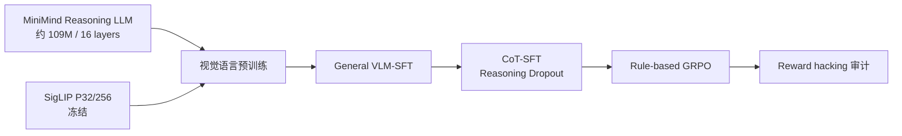

# MiniMind-V-Reasoning

MiniMind-V-Reasoning 是一个面向约 100M 参数量级多模态模型的探索项目。模型以 MiniMind Reasoning LLM 为语言主干，连接冻结的 SigLIP 视觉编码器，依次进行视觉语言对齐、通用 VLM-SFT、结构化 CoT-SFT，并尝试无需奖励模型的规则 GRPO。

项目的重点不是追求大模型级绝对指标，而是回答一个更实际的问题：**约 109M 的语言模型在有限算力下能学会多少读图、短答案决策和结构化推理能力，瓶颈又在哪里？**

## 模型与训练路径



| 模块 | 配置 |
|---|---|
| Language backbone | MiniMind Reasoning，hidden size 768，16 layers |
| LLM 参数量 | 108,946,176 |
| Attention / KV heads | 8 / 2 |
| FFN intermediate | 2048 |
| Vision encoder | SigLIP P32/256，约 93M，始终冻结 |
| Vision tokens | 64 |
| Vision-language projector | 2 层 MLP，可训练 |
| 输出格式 | `<think>...</think><answer>...</answer>` |

项目所说的“约 100M 小模型”主要指可训练和保存的语言主干；冻结视觉编码器不计入这一口径。

## 主要结果

- 视觉预训练有效：真实图像验证 loss 为 3.0470，图像错配后升至 3.6754，说明模型确实利用了匹配的视觉语义。
- 扩大通用 SFT 数据仍有收益：固定验证 loss 从 300K 的 3.5408 降到 600K 的 3.3331，分阶段全量训练后为 3.0263。
- CoT-SFT 能形成结构化推理模式，但收益不稳定。Reasoning Dropout 0.2 提高双模式鲁棒性和 think 完整率，却略损伤通用生成 F1。
- 第一版规则 GRPO 是典型 reward hacking：格式率从 17% 升到 85%，平均奖励从 0.1148 升到 0.3467，但答案准确率始终为 0。
- 修复奖励解析并增加短答案 warmup 后，选择题最高仅 29%，计数最高 4%，OCR 为 0；更重要的是通用能力一度只保留 46%–51%。
- 保守 warmup 能把通用 F1 保留在 96% 左右，但 held-out 宏准确率仅 2.5%–3.3%，且真实图像不优于置空/错配图像，因此没有继续扩大 GRPO。

## 核心发现

1. **格式奖励不是能力奖励。** 对 100M 模型而言，XML 标签比视觉答案容易学习得多；只要格式分可以独立获得，策略就会优先优化外壳。
2. **token loss 和视觉 grounded accuracy 必须分开看。** 模型能在 teacher-forced loss 上表现出图像依赖，却仍可能在自由生成时依赖语言先验。
3. **RL 之前必须先有非零且稳定的成功样本。** 当 greedy 和采样准确率接近零时，GRPO 缺少可用组内优势，增加 rollout 只会放大奖励设计问题。
4. **100M 容量下灾难性遗忘非常敏感。** 高权重短答案监督能快速改善格式和选择题，但会明显侵蚀通用生成；冻结底层并加入 30% replay 可保留能力，却不能补出原本不存在的视觉决策能力。
5. **失败是有边界的结论。** 当前结果不说明 GRPO 对小模型普遍无效，而说明该 checkpoint 尚未达到适合 RL 的能力门槛；先改善视觉 grounding 和短答案 SFT，比继续调 KL/奖励权重更关键。

## 代码入口

```text
model/model_profiles.py                 109M 模型配置
model/model_minimind.py                 语言模型与停止序列生成
model/model_vlm.py                      SigLIP、Projector 与加权 token loss
trainer/train_pretrain_vlm.py           多模态预训练
trainer/train_sft_vlm.py                General / CoT / 短答案 SFT
trainer/train_grpo_vlm.py               原生 PyTorch 规则 GRPO
scripts/audit_grpo_reward.py            GRPO 前后奖励审计
scripts/evaluate_rl_by_task.py          分任务短答案评测
scripts/evaluate_warmup_v3_diagnostics.py 真实/置空/错配图诊断
tests/test_reward_parser.py             奖励解析回归测试
```

更完整的参数、对照设计和图表见 [EXPERIMENT_REPORT.md](./EXPERIMENT_REPORT.md)。

## 环境

- 4 × NVIDIA A10 24GB
- PyTorch DDP
- SwanLab 记录训练过程
- vLLM 仅用于教师 CoT 数据蒸馏

GRPO 保留为项目中的规则优化实现，但不把当前失败 checkpoint 作为最终模型。对于单机 4 卡和约 109M 模型，原生 PyTorch 实现足以控制 rollout、KL、奖励与消融变量。
