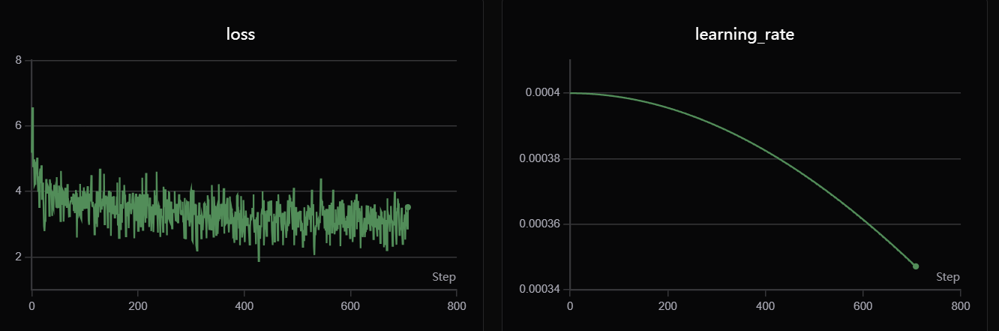
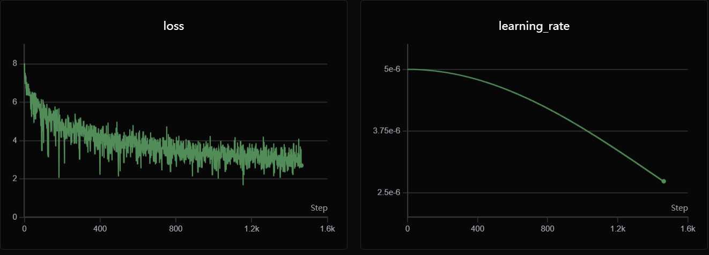
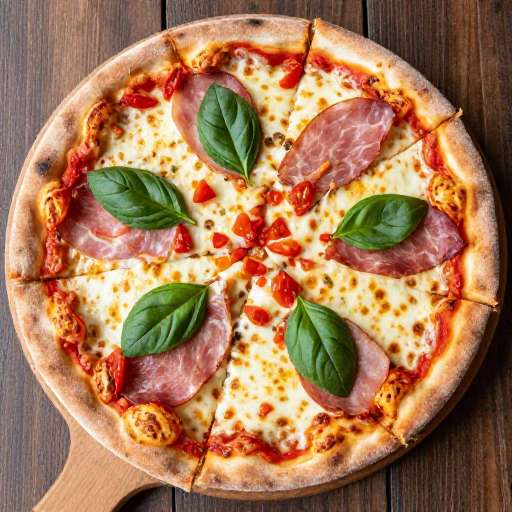
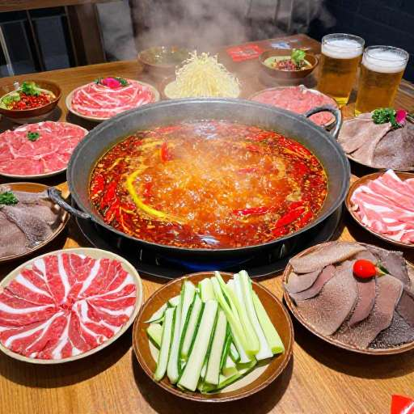
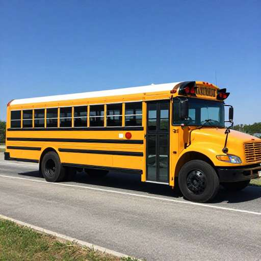

# 项目介绍

在原有[Minimind-v](https://github.com/jingyaogong/minimind-v#)基础上，增加**推理**功能，让模型具有思考能力！

# 快速开始


## 从0开始训练


### 1' 环境准备

```bash
pip install -r requirements.txt -i https://pypi.tuna.tsinghua.edu.cn/simple
```

<details>
<summary>注：提前测试Torch是否可用cuda</summary>

```bash
import torch
print(torch.cuda.is_available())
```

如果不可用，请自行去[torch_stable](https://download.pytorch.org/whl/torch_stable.html)
下载whl文件安装。参考[链接](https://blog.csdn.net/weixin_45456738/article/details/141029610?ops_request_misc=&request_id=&biz_id=102&utm_term=%E5%AE%89%E8%A3%85torch&utm_medium=distribute.pc_search_result.none-task-blog-2~all~sobaiduweb~default-2-141029610.nonecase&spm=1018.2226.3001.4187)

</details>

### 2' 数据下载

**minimind-v 原项目数据集（Pretrain+SFT阶段）：**


从下文提供的[数据集链接](https://huggingface.co/datasets/jingyaogong/minimind-v_dataset)
下载所需内容并放到`./dataset`下。


<details>
<summary>下载pretrain/sft数据须知</summary>

Pretrain数据：
```bash
wget https://hf-mirror.com/datasets/jingyaogong/minimind-v_dataset/resolve/main/pretrain_i2t.parquet
```

SFT数据：
```bash
wget https://hf-mirror.com/datasets/jingyaogong/minimind-v_dataset/resolve/main/sft_i2t.parquet
```

建议预留~2GB空间存放数据集，若无多余空间存放pretrain数据，可尝试跳过pretrain训练步骤直接进行sft训练。

</details>


**推理阶段数据：(CoT SFT + RL阶段)**


CoT SFT数据：

这个阶段的数据集是通过将原项目中SFT数据进行蒸馏得到，具体实现见dataset/distilled_sft_i2t.py


RL阶段数据：

这里使用的是[Innovator-VL-RL-172K](
https://huggingface.co/datasets/InnovatorLab/Innovator-VL-RL-172K)


<details>
<summary>下载RL，蒸馏数据须知</summary>

CoT SFT蒸馏：
```bash
export DISTILL_API_KEY="你的api key"
python dataset/distilled_sft_i2t.py
``` 
这个蒸馏过程需要调用外部api，对数据生成解释，比较耗时。


RL数据：
```python
from datasets import load_dataset

ds = load_dataset("InnovatorLab/Innovator-VL-RL-172K")
```

RL数据大概需要占据~10GB的空间，建议提前做好准备。
</details>

### 3' 开始训练

这里为了适配推理任务，LLM部分使用的是minimind官方提供的reasoning权重（在out/llm_768.pth），训练分为三个阶段：

**3.1 预训练（学图像描述）**

```bash
# 基础训练命令（从LLM权重开始，仅训练vision_proj）
python train_pretrain_vlm.py --epochs 4 --from_weight llm
```

> 执行预训练，得到 `pretrain_vlm_*.pth` 作为预训练的输出权重（其中*为模型的dimension，默认为768）


**3.2 第一阶段监督微调（学看图对话方式）**

```bash
# 基础训练命令（从预训练权重开始，全参数微调）
python train_sft_vlm.py --epochs 2 --from_weight pretrain_vlm
```

> 执行监督微调，得到 `sft_vlm_*.pth` 作为指令微调的输出权重

**3.3 第1.5阶段监督微调（学推理方式）**

```bash
# 基础训练命令（从预训练权重开始，全参数微调）
python train_sft_vlm.py --epochs 2 --from_weight sft_vlm --data_path ../dataset/sft_i2t_cot_distilled.parquet --save_weight sft_vlm_cot
```

> 执行监督微调，得到 `sft_vlm_cot_*.pth` 作为指令微调的输出权重


**3.3 第三阶段GRPO（增加准确率）**

```bash
# 基础训练命令（从第一阶段微调权重开始，全参数微调）
python train_grpo_vlm.py 

```


<details>
<summary>注：训练须知</summary>

**训练特性：**
- 支持断点续训：添加`--from_resume 1`参数可从上次中断处继续训练
- 支持GPU数量变化：续训时GPU数量改变会自动转换step
- 原子性保存：使用临时文件+替换机制，防止保存过程中断导致权重损坏
- 每次保存同时生成`out/**.pth`（模型权重）和`checkpoints/**_resume.pth`（训练状态）文件

```bash
# 训练中断后，使用相同命令并添加 --from_resume 1
python train_sft_vlm.py --epochs 4 --from_resume 1
```

**参数说明：**
- `--from_weight`: 基础权重名称（llm, pretrain_vlm, none等）
- `--save_weight`: 保存权重的前缀名
- `--from_resume`: 是否续训（0=从头开始，1=从检查点继续）
- `--freeze_llm`: 是否冻结LLM参数（仅pretrain使用）
- 更多可直接参考代码

</details>


---

### 4' 测试模型效果

确保需要测试的模型`*.pth`文件位于`./out/`目录下。

```bash
# 测试SFT模型（默认）
python eval_vlm.py --weight sft_vlm

# 测试Pretrain模型
python eval_vlm.py --weight pretrain_vlm

# 测试RL模型
python eval_vlm.py --weight grpo_vlm

# 测试SFT CoT模型
python eval_vlm.py --weight sft_vlm_cot

```

# 📌 评估

### 实验结果


Pretrain [768+8] (dense)



SFT [768+8] (dense)



### 效果测试

#### 单图对话

这里cot-prompt让模型简要回答，推理后总结成一句

<table>
  <thead>
    <tr>
      <th>image</th>
      <th>minimind-3v</th>
      <th>minimind-3v-cot</th>
    </tr>
  </thead>
  <tbody>
    <tr>
      <td>
        
        &nbsp;&nbsp;&nbsp;&nbsp;&nbsp;&nbsp;&nbsp;&nbsp;&nbsp;&nbsp;&nbsp;&nbsp;&nbsp;&nbsp;&nbsp;&nbsp;&nbsp;&nbsp;&nbsp;&nbsp;&nbsp;&nbsp;&nbsp;&nbsp;&nbsp;&nbsp;&nbsp;&nbsp;&nbsp;&nbsp;&nbsp;&nbsp;&nbsp;&nbsp;&nbsp;&nbsp;&nbsp;&nbsp;&nbsp;&nbsp;
      </td>
      <td>图中可见一架飞机正朝着飞机飞行。这架飞机正从一架白色飞机上起飞。</td>
      <td>根据图像，可以看到一架白色的飞机在空中飞行。</td>
    </tr>
    <tr>
      <td>
        
        &nbsp;&nbsp;&nbsp;&nbsp;&nbsp;&nbsp;&nbsp;&nbsp;&nbsp;&nbsp;&nbsp;&nbsp;&nbsp;&nbsp;&nbsp;&nbsp;&nbsp;&nbsp;&nbsp;&nbsp;&nbsp;&nbsp;&nbsp;&nbsp;&nbsp;&nbsp;&nbsp;&nbsp;&nbsp;&nbsp;&nbsp;&nbsp;&nbsp;&nbsp;&nbsp;&nbsp;&nbsp;&nbsp;&nbsp;&nbsp;
      </td>
      <td>图中所示的是一个生日蛋糕，上面有一个蜡烛和一个糖霜。甜甜圈上有一只蜡烛，周围散落着一根蜡烛。此外还有一些蜡烛散落在整个蛋糕周围，形成了一个精美的装饰图案。
图片中还有一只蜡烛，表明这是一场生日派对，为生日聚会增添了浪漫元素。</td>
      <td> 图片显示了一张生日蛋糕，上面有蜡烛。</td>
    </tr>
    <tr>
      <td>
        
        &nbsp;&nbsp;&nbsp;&nbsp;&nbsp;&nbsp;&nbsp;&nbsp;&nbsp;&nbsp;&nbsp;&nbsp;&nbsp;&nbsp;&nbsp;&nbsp;&nbsp;&nbsp;&nbsp;&nbsp;&nbsp;&nbsp;&nbsp;&nbsp;&nbsp;&nbsp;&nbsp;&nbsp;&nbsp;&nbsp;&nbsp;&nbsp;&nbsp;&nbsp;&nbsp;&nbsp;&nbsp;&nbsp;&nbsp;&nbsp;
      </td>
      <td>图片显示了几个披萨放在木桌上的披萨。首先，这块披萨是用红色或绿色切成薄片的。其中一块是白色的，而另一块则是绿色的。桌子上放着一把切成片的胡萝卜，这表明了他们正在享受一顿美味的披萨。
除了披萨外，桌上还有两个碗，里面盛着几片黄色的野菜，这可能暗示着他们可能正在享用某种美味而又营养丰富的披萨。</td>
      <td>图示中，一大片披萨被放置在木制木桌上。</td>
    </tr>
    <tr>
      <td>
        
        &nbsp;&nbsp;&nbsp;&nbsp;&nbsp;&nbsp;&nbsp;&nbsp;&nbsp;&nbsp;&nbsp;&nbsp;&nbsp;&nbsp;&nbsp;&nbsp;&nbsp;&nbsp;&nbsp;&nbsp;&nbsp;&nbsp;&nbsp;&nbsp;&nbsp;&nbsp;&nbsp;&nbsp;&nbsp;&nbsp;&nbsp;&nbsp;&nbsp;&nbsp;&nbsp;&nbsp;&nbsp;&nbsp;&nbsp;&nbsp;
      </td>
      <td>这幅图片描绘了一辆黄色的大红色汽车和一辆红色摩托车，还有一辆蓝色汽车。汽车的轮子、车身和后座都出现在场景中。
在画面的右边，是白色的部分，背景中有一个红色的交通信号灯。这辆车停在附近，可能正在进行某种活动或观看。</td>
      <td> 根据图像描述，这辆红色的车停在一条道路上，可能是为了在赛道上行驶。</td>
    </tr>
    <tr>
      <td>
        
        &nbsp;&nbsp;&nbsp;&nbsp;&nbsp;&nbsp;&nbsp;&nbsp;&nbsp;&nbsp;&nbsp;&nbsp;&nbsp;&nbsp;&nbsp;&nbsp;&nbsp;&nbsp;&nbsp;&nbsp;&nbsp;&nbsp;&nbsp;&nbsp;&nbsp;&nbsp;&nbsp;&nbsp;&nbsp;&nbsp;&nbsp;&nbsp;&nbsp;&nbsp;&nbsp;&nbsp;&nbsp;&nbsp;&nbsp;&nbsp;
      </td>
      <td> 图中有两扇大窗户，一扇大窗户在房间内。</td>
      <td> 图中描绘了一幅色彩斑斓的城市景象，包括蓝色和白色的房屋和建筑物。</td>
    </tr>
    <tr>
      <td>
        
        &nbsp;&nbsp;&nbsp;&nbsp;&nbsp;&nbsp;&nbsp;&nbsp;&nbsp;&nbsp;&nbsp;&nbsp;&nbsp;&nbsp;&nbsp;&nbsp;&nbsp;&nbsp;&nbsp;&nbsp;&nbsp;&nbsp;&nbsp;&nbsp;&nbsp;&nbsp;&nbsp;&nbsp;&nbsp;&nbsp;&nbsp;&nbsp;&nbsp;&nbsp;&nbsp;&nbsp;&nbsp;&nbsp;&nbsp;&nbsp;
      </td>
      <td>图中描绘的是一个美丽的山坡，上面有树木和树林。山上有几棵树，树冠在背景中闪烁着。
画面中有一个男人站在一片开阔的斜坡上，背景中有树木。这个场景似乎是在欣赏美丽湖景的一个关键位置。
此外，可以看到一个远处的山坡上有几座小船，这说明这是一艘游艇和一排水道的存在。</td>
      <td>图中所示，一个湖泊的自然景观，包括山脉、湖泊和湖泊。</td>
    </tr>
    <tr>
      <td>
        
        &nbsp;&nbsp;&nbsp;&nbsp;&nbsp;&nbsp;&nbsp;&nbsp;&nbsp;&nbsp;&nbsp;&nbsp;&nbsp;&nbsp;&nbsp;&nbsp;&nbsp;&nbsp;&nbsp;&nbsp;&nbsp;&nbsp;&nbsp;&nbsp;&nbsp;&nbsp;&nbsp;&nbsp;&nbsp;&nbsp;&nbsp;&nbsp;&nbsp;&nbsp;&nbsp;&nbsp;&nbsp;&nbsp;&nbsp;&nbsp;
      </td>
      <td>图片显示了热腾腾的汤，里面有各种香肠、肉松、蔬菜和肉类，包括牛排、烤肉和炖菜。总共有八个人在桌子上，每个人都戴着自己的话。
餐桌上摆放着几个盆栽植物，其中一个靠近左边，另一个靠近右边。还有一个大号的茶杯放在桌子上。
桌子上还摆放着一个杯子，这表明它们可能是在一个开放式的用餐区。
此外，靠近左边的桌子，可以看到更远的距离，而靠近右边的桌子也表明它们是可开窗的。
桌上还有一盆盆栽植物，其中一个在右边，其他的则靠近左边。</td>
      <td> 图中展示了一种热闹的、充满活力的餐桌场景，其中包括一个热闹的餐桌和各种各样的盘子。</td>
    </tr>
    <tr>
      <td>
        
        &nbsp;&nbsp;&nbsp;&nbsp;&nbsp;&nbsp;&nbsp;&nbsp;&nbsp;&nbsp;&nbsp;&nbsp;&nbsp;&nbsp;&nbsp;&nbsp;&nbsp;&nbsp;&nbsp;&nbsp;&nbsp;&nbsp;&nbsp;&nbsp;&nbsp;&nbsp;&nbsp;&nbsp;&nbsp;&nbsp;&nbsp;&nbsp;&nbsp;&nbsp;&nbsp;&nbsp;&nbsp;&nbsp;&nbsp;&nbsp;
      </td>
      <td>该图片显示了一只白色的小白猫，它站在篮子里，很可能正在观察和照顾这只小猫。一只灰色的小猫被放置在一个篮子里，这表明这只小猫可能正在与小猫互动或研究它们的生活。
此外，小猫的出现还暗示了这只猫可能正在与其他猫互动或观察周围的环境。总体而言，这只小猫很可能正在进行一次长途旅行或者观察周遭环境，因为它能提供关于周围环境、人与动物之间关系以及潜在宠物动物的有趣事实。</td>
      <td>根据图像描述，可以推断出三只小猫在篮子里玩耍，它正站在篮子里。</td>
    </tr>
    <tr>
      <td>
        
        &nbsp;&nbsp;&nbsp;&nbsp;&nbsp;&nbsp;&nbsp;&nbsp;&nbsp;&nbsp;&nbsp;&nbsp;&nbsp;&nbsp;&nbsp;&nbsp;&nbsp;&nbsp;&nbsp;&nbsp;&nbsp;&nbsp;&nbsp;&nbsp;&nbsp;&nbsp;&nbsp;&nbsp;&nbsp;&nbsp;&nbsp;&nbsp;&nbsp;&nbsp;&nbsp;&nbsp;&nbsp;&nbsp;&nbsp;&nbsp;
      </td>
      <td>这张图片描绘了一片美丽的棕榈树，旁边是一根棕榈树，这根棕榈树在阳光下闪烁着五彩斑斓的蓝色和白色。
在靠近树林的地方，可以看到一个白色大沙沙地，给人一种宁静而祥和的感觉。棕榈树为画面增添了几分神秘和美丽。
此外，周围的树木和水面亦显得繁忙而又安静。白色天鹅和棕榈树的存在暗示着一个人或一群人在自然中漫步，享受着彼此陪伴的感觉。</td>
      <td>最终结论是：一张椅子被放置在海滩上，旁边是棕榈树。</td>
    </tr>
    <tr>
      <td>
        
        &nbsp;&nbsp;&nbsp;&nbsp;&nbsp;&nbsp;&nbsp;&nbsp;&nbsp;&nbsp;&nbsp;&nbsp;&nbsp;&nbsp;&nbsp;&nbsp;&nbsp;&nbsp;&nbsp;&nbsp;&nbsp;&nbsp;&nbsp;&nbsp;&nbsp;&nbsp;&nbsp;&nbsp;&nbsp;&nbsp;&nbsp;&nbsp;&nbsp;&nbsp;&nbsp;&nbsp;&nbsp;&nbsp;&nbsp;&nbsp;
      </td>
      <td>这幅图片展示了一个校庆场景，包括一个红色和黄色的公交车和一辆停在公交车旁边的几辆公交车。前景中几辆停放在一起，其中一些停靠在靠近画面边缘的地方，而另一些则靠近画面的中心部分，为画面增添了几分古色古香的气息。
背景中有几辆汽车停在背景中，其中一辆车更靠近公交车旁边。还有一辆汽车停在场景左侧，另一辆更靠右，而更靠左的则停在更靠后位置。</td>
      <td>图中显示的是一辆黄色的巴士，它停在路边。</td>
    </tr>
  </tbody>
</table>


### 效果小结：

总体来说，回答更加简洁明了，对于图片中的主要内容提取能力更强了，但是还是有幻觉情况存在，并且推理能力由于数据集样本太小，训练也还暂时不够充分，推理能力还有很大上升空间。


