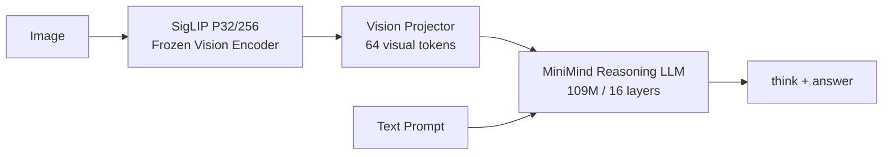
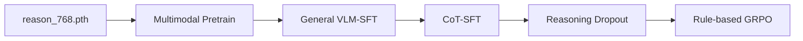

# MiniMind-V-Reasoning

MiniMind-V-Reasoning 是一个约 109M 参数的轻量多模态推理模型实验项目。项目以 MiniMind Reasoning LLM 为语言基座，连接冻结的 SigLIP 视觉编码器，通过多模态预训练、视觉指令微调、结构化 CoT 蒸馏和规则奖励 GRPO，研究小模型在有限算力下获得读图、简短推理和可验证决策能力的可行路径。

## 项目目标

项目围绕三个问题展开：

1. Reasoning LLM 能否通过重新进行视觉语言对齐，稳定获得读图能力？
2. 一句式结构化 CoT 与 Reasoning Dropout 能否增强推理，同时降低固定模板依赖？
3. 不训练额外奖励模型，仅使用答案一致性规则，GRPO 能否进一步提升可验证视觉任务表现？

## 模型架构



### 核心配置

| 模块 | 配置 |
|---|---|
| Language Backbone | MiniMind Reasoning |
| LLM参数量 | 108,946,176 |
| Hidden size | 768 |
| Transformer layers | 16 |
| Attention / KV heads | 8 / 2 |
| FFN intermediate | 2048 |
| Vocabulary | 6400 |
| Vision Encoder | SigLIP，image 256，patch 32，冻结 |
| Vision tokens | 64 |
| Vision Projector | 2层MLP，可训练 |
| 推理格式 | `<think>...</think><answer>...</answer>` |

Vision Encoder 约 93M 参数但始终冻结；项目训练和保存的主体是约 109M LLM 与 Vision Projector。

## 训练流程



1. **Multimodal Pretrain**：冻结SigLIP，训练Projector和少量语言层，建立视觉语言对齐。
2. **General VLM-SFT**：学习视觉描述、OCR、计数、问答和指令跟随。
3. **CoT-SFT**：使用清洗后的结构化一句式推理数据注入推理模式。
4. **Reasoning Dropout**：随机移除完整think块，缓解模型对固定模板的依赖。
5. **Rule-based GRPO**：在选择题、数字、OCR和短答案任务上使用可验证规则奖励优化答案决策。

## 方案对比

| 早期方案 | 当前方案 | 原因 |
|---|---|---|
| 约67M、8层默认结构 | 约109M、16层Reason主线 | 与`reason_768.pth`严格兼容 |
| `strict=False`宽松加载 | 主干权重严格shape校验 | 防止静默加载错误 |
| 写死P16/256视觉输入 | 自动读取P32/256 patch数量 | 适配实际下载的视觉模型 |
| 普通SFT和CoT脚本分叉 | 共用`train_sft_vlm.py` | 减少重复训练代码 |
| 只截短推理 | 独立Reasoning Dropout | 正确验证模板依赖假设 |
| GRPO冻结LLM | GRPO更新LLM与Projector | 让策略模型真正学习 |
| answer标签与reward解析错配 | 统一解析`<answer>` | 保证正确答案获得奖励 |
| 单卡串行蒸馏 | 4卡vLLM异步蒸馏 | 将30万样本压缩到一个工作日完成 |

### 训练阶段对比

| 阶段 | 初始化 | 可训练模块 | 数据 | 主要目标 |
|---|---|---|---:|---|
| Multimodal Pretrain | Reason LLM | Projector + LLM第0层 | 127万 | 视觉语言对齐 |
| General VLM-SFT | Pretrain | Projector + LLM | 30–290万 | 通用读图与指令跟随 |
| CoT-SFT | General SFT | Projector + LLM | 18.6万 + 混合数据 | 注入结构化推理 |
| GRPO | CoT-SFT | Policy LLM + Projector | 1千–2万 | 优化可验证答案决策 |

### 核心消融对比

| 对比 | 控制变量 | 回答的问题 |
|---|---|---|
| Real Image vs Zero Image | 文本、模型、样本一致 | 模型是否真正使用图像？ |
| SFT-300K vs SFT-600K | 训练配置一致 | 增加SFT数据是否继续有效？ |
| General SFT vs CoT-SFT | 是否加入CoT | CoT是否提升推理能力？ |
| Dropout 0 vs 0.2 | 推理数据一致 | 随机丢弃是否缓解模板依赖？ |
| CoT-SFT vs GRPO | 初始化与评测集一致 | 规则奖励是否提升答案准确率？ |

### 数据版本对比

| 数据 | 样本数 | 用途 | 状态 |
|---|---:|---|---|
| Pretrain | 1,274,698 | 视觉语言对齐 | 已就绪 |
| General SFT | 2,904,511 | 通用视觉指令 | 已就绪 |
| Distilled CoT | 300,023 | 清洗前对照 | 已完成 |
| Clean CoT | 186,094 | CoT-SFT主数据 | 已完成 |

## 已完成实验概览

### CoT数据蒸馏

- 原始图文指令：2,904,511条
- 通过前置过滤：2,202,245条
- 四卡蒸馏结果：300,023条
- 成功率：99.49%
- 总耗时：约8小时13分钟
- 最终吞吐：约10.15 samples/s

### CoT质量清洗

- 过滤模板化元推理：113,929条
- Clean CoT：186,094条
- 保留率：62.03%
- 格式错误、空答案、损坏图片：0

### 模型兼容与视觉链路

- `reason_768.pth` 147个tensor严格匹配
- Shape mismatch：0
- Unexpected keys：0
- 文本前向测试通过
- SigLIP P32单图forward/backward通过
- Vision Projector梯度非零

详细记录见 [EXPERIMENT_REPORT.md](./EXPERIMENT_REPORT.md)，后续安排见 [EXPERIMENT_PLAN.md](./EXPERIMENT_PLAN.md)。

## 当前效果

当前已完成数据工程、模型兼容和单图训练链路验证，正式多阶段训练尚未开始。以下指标将在固定验证集上逐阶段补充：

| 模型阶段 | 普通VQA | OCR | 计数 | 可验证推理 | 格式合规率 |
|---|---:|---:|---:|---:|---:|
| Reason LLM（无视觉） | - | - | - | 待测 | 待测 |
| Multimodal Pretrain | 待实验 | 待实验 | 待实验 | - | - |
| General VLM-SFT | 待实验 | 待实验 | 待实验 | 待实验 | 待实验 |
| CoT-SFT | 待实验 | 待实验 | 待实验 | 待实验 | 待实验 |
| CoT-SFT + GRPO | 待实验 | 待实验 | 待实验 | 待实验 | 待实验 |

## 主要文件

```text
model/model_profiles.py             统一的reason_vlm_109m配置
model/model_minimind.py             Reason LLM结构
model/model_vlm.py                  SigLIP与Vision Projector
trainer/train_pretrain_vlm.py       多模态预训练
trainer/train_sft_vlm.py            普通SFT与CoT-SFT
trainer/train_grpo_vlm.py           原生PyTorch GRPO
scripts/validate_reason_checkpoint.py  权重兼容验证
dataset/distill_multigpu.py         四卡异步蒸馏
dataset/filter_meta_reasoning.py     元推理清洗
```

## 训练环境

- 4×NVIDIA A10 24GB
- PyTorch DDP
- SwanLab实验监控
- vLLM仅用于教师数据蒸馏

本项目的GRPO暂不使用VERL。对于单机4卡和约109M模型，原生PyTorch实现更便于控制rollout、奖励、KL和消融变量；如果未来扩展到多机、大规模异步rollout或独立推理集群，再考虑迁移到VERL。
